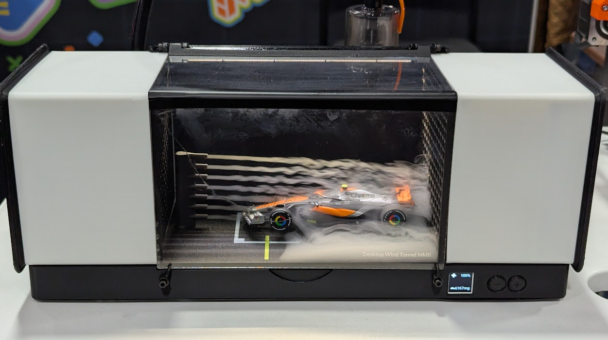

# What is this
This repository contains configuration and a Grafana dasboard configuration for the wind tunnel project.




# Configuration
* Connect to <TODO>
* Password is secret in this version (ask Tom)
* ESP32 in the wind tunnel will give itself 192.168.4.1/24
* Client range starts at 192.168.4.100
* Port 80, so metrics at 192.168.4.1:80/metrics
* Name the Prometheus job `wind-tunnel`
* Changing the datasource ID in the UI is a pain (seems impossible?), so figure out the ID with an existing dashboard and edit the JSON before importing it

# Installing esphome & compiling this project on a Mac
```sh
# We'll use pipx to install esphome, and brew to install pipx
$ brew install pipx libmagic

# Install esphome in its own virtual env
$ pipx install esphome

# Add some dependencies to the virtual env
$ pipx runpip esphome install python-magic pillow==10.4.0 cairosvg

# Install the wind tunnel (first time - your device name will vary)
$ ~/.local/bin/esphome run --device=/dev/tty.usbmodem31301 wind-tunnel.yaml

# Install the wind tunnel (susequent times, via WiFi)
$ ~/.local/bin/esphome run  wind-tunnel.yaml
```

# TODO: Setting up Grafana and Prometheus on your Mac
